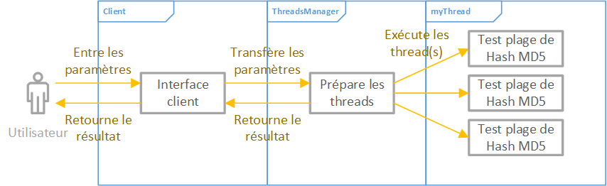

# HEIG-VD PCO - Laboratoire 3
Auteurs :
- Arthur Bécaud (arthur.becaud@heig-vd.ch)
- Bruno Egremy (bruno.egremy@heig-vd.ch)

## Introduction
Ce laboratoire 3 du cours PCO à pour objectif de nous familiariser à la gestion de threads. Le but de ce projet est de transformer un programme monothread en multithreads. Ce programme consiste à cracker un hash md5 en affichant une barre de progression.

## Conception
Nous avons conçu notre version multithread de façon à ditribuer la plage de hashs à générer sur le nombre de threads demandés. Notre système fonctionne ainsi de la manière suivante :

## Implémentation
L'implémentation a été diviser en deux parties :
- Le manager de processus (ThreadManager).
- L'environnement d'exécution des threads (mythread.h/.cpp).

### Manager de processus
Celui-ci reçoit les informations de l'interface graphique et en fonction de celles-ci, partitionne le travail (les hash à calculer) de façon à assigner lesdites partitions aux différents threads (ceux demandés par l'utilisateur).

Le Manager va d'abord initialiser l'environnment d'éxécution des threads avec les informations en communs : charset, salt, hash et le nombre de caractères du mot de passe recherché.  

Ensuite, afin de découper le travail de manière optimale, il convient de donner le même nombre de hash à calculer à chaque thread. Cela est fait en appelant la fonction _findEqualDistribution()_ qui retournera une distribution des calculs à opérer.

Les threads incrémentant à chaque fois le mot de passe qu'ils testent, il faut leur fournir un mot de passe de départ (qui est différent pour chaque thread). La fonction _findStartingPasswordStates()_ permet, en fonction de la distribution des calculs, de trouver ces mots de passe initiaux.

Le Manager peut alors créer les différents threads avec la configuration adéquate.

Lorsque que tous les threads auront terminé (auront été join()), le Manager retournera la solution à l'aide de la fonction _getSolution()_.

### Environnement d'exécution des threads
Un thread va calculer des hashs afin de trouver le mot de passe original. Pour ce faire, il reçoit, du Manager, un mot de passe de départ qu'il incrémentera à chaque tentative, ainsi qu'un nombre de hash à calculer.

Si le thread trouve un mot de passe dont le hash correspond au hash de référence donné par le Manager alors il notifie les autres threads à l'aide d'un flag _isFound_ et stocke le mot de passe dans la variable _solution_ puis termine.

Les threads n'ayant pas trouvé de solution doivent continuer de calculer des hashs tant qu'un autre thread ne les notifie pas par le biais du flag _isFound_ ou tant qu'ils n'ont pas calculé suffisament de hashs (ils doivent au maximum calculer le nombre de hashs édicté par le Manager). Si les conditions font qu'ils doivent arréter de calculer alors ils se terminent.

De plus, chaque thread a pour tâche de mettre à jour la barre de progression de l'interface graphique via la fonction donnée par le Manager appelée _tm->incrementPercentComputed()_ et ce en fonction du nombre de calculs effectués.

## Vérification du fonctionnement
L'application a été testé en entrant différent paramètres :

| Original Salt | Original Password | Pass lentgh | Salt | MD5 Hash                         | Threads | Result       |
|---------------|-------------------|-------------|------|----------------------------------|---------|--------------|
|               | pass              | 4           |      | 1a1dc91c907325c69271ddf0c944bc72 | 1       | Found!       |
|               | pass              | 4           |      | 1a1dc91c907325c69271ddf0c944bc72 | 2       | Found!       |
|               | pass              | 4           |      | 1a1dc91c907325c69271ddf0c944bc72 | 5       | Found!       |
|               | pass              | 4           | salt | 1a1dc91c907325c69271ddf0c944bc72 | 1       | Not found... |
|               | pass              | 4           | salt | 1a1dc91c907325c69271ddf0c944bc72 | 5       | Not found... |
| 123           | abcde             | 5           | 123  | 6796770dfc7eed04d3c796fe2c2dcc97 | 1       | Found!       |
| 123           | abcde             | 5           | 123  | 6796770dfc7eed04d3c796fe2c2dcc97 | 5       | Found!       |
