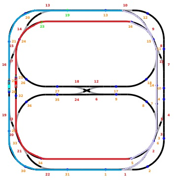

# HEIG - PCO Laboratoire 5 - Simulation de train
Auteurs : Arthur Bécaud et Bruno Egremy
## Description des fonctionnalités du logiciel
Ce laboratoire 5 à pour objectif de réaliser un programme concurrent où il y a des situations de compétition et de gestion de ressources, et ce à l’aide de sémaphores. Le contexte de ce projet est d'implémenter un réseau de locomotive avec *une* section partagée.

Le logiciel possède ainsi deux fonctionnalités :

- Gestion du comportement d'une locomotive.
- Gestion du d'une section partagée sur le réseau de locomotive.

## Choix d'implémentation
Nous avons décidé d'implémenter la section partagée sans limitation sur le nombre de locomotive.
### Parcours des locomotives

Locomotive bleu : parcours bleu.\
Locomotive rouge : parcours rouge.\
Section partagée : parcours violet.



### Programme 1
#### Comportement  d'une locomotive
Le thread d'une locomotive effectue deux tours dans un sens puis deux tours dans l'autre sens en boucle, géré par `LocomotiveBehavior::run`.
```c++
void LocomotiveBehavior::run()
{
    // Initialisation de la locomotive
    loco.allumerPhares();
    loco.demarrer();
    loco.afficherMessage("Ready!");

    // Fait avancer la locomotive à l'infini
    while (true) {
        // Réalise deux tours de la locomotive dans le sens horaire
        for (int i = 0; i < 1; i++) {
            lapManagement(start,
                          forwardContacts[0],
                          forwardContacts[0],
                          backwardContacts[1],
                          forwardPoints[0],
                          forwardPoints[1],
                          backwardPoints[0],
                          backwardPoints[1]);
        }
        // Inverse le sens de la locomotive
        loco.inverserSens();
        // Réalise deux tours de la locomotive dans le sens anti-horaire
        for (int i = 0; i < 1; i++) {
            lapManagement(start,
                          backwardContacts[0],
                          backwardContacts[0],
                          forwardContacts[1],
                          backwardPoints[0],
                          backwardPoints[1],
                          forwardPoints[0],
                          forwardPoints[1]);
        }
        // Inverse le sens de la locomotive
        loco.inverserSens();
    }
}
```
Un tour commence par attendre un signal du contact d'accès pour effectuer un appel d'accès à la section partagée. Selon l'état de la section la locomotive s'arrête où continue son chemin. Du moment que la section est libre la locomotive continue ou redémarre et change l'état des aguillages d'entrée et de sortie pour accéder à la section. Ensuite il faut attendre que la locomotive atteigne le contact de sortie de la section pour indiquer que la section partagée est libre. Le tour se termine lorsque la locomotive atteint le contact de départ.
```c++
void LocomotiveBehavior::lapManagement(unsigned startContact,
                                       unsigned requestContact,
                                       unsigned accessContact,
                                       unsigned leaveContact,
                                       unsigned entryPoint,
                                       unsigned entryPosition,
                                       unsigned leavePoint,
                                       unsigned leavePosition) {
    // Attend que la locomotive atteigne le contact de requête (pas néscéssaire donc pas utilisée)
    // attendre_contact(requestContact);
    // sharedSection->request(loco, (SharedSectionInterface::Priority) 0);
    // Attend que la locomotive atteigne le contact d'accès à la section partagée
    attendre_contact(accessContact);
    sharedSection->getAccess(loco, (SharedSectionInterface::Priority) 0);
    // Redirige les deux aiguillage de la section partagée
    diriger_aiguillage(entryPoint, entryPosition, 0);
    diriger_aiguillage(leavePoint, leavePosition, 0);
    // Attend que la locomotive sorte de la section puis informe sa sortie
    attendre_contact(leaveContact);
    sharedSection->leave(loco);
    // Attend que la locomotive retourne au point de départ
    attendre_contact(startContact);
}
```
#### Implémentation de la section partagée
La classe de la section partagée permet de partager une section critique entre deux locomotive via deux appels : `getAccess` et `leave`. Ces appels permettent ainsi d'éviter que deux locomotives fassent un accident en entrant toutes les deux dans la même section partagée au même moment.

La protection de cette section critique se fait avec _flag_ d'occupation avec son mutex et une barrière pour l'attente d'accès à la section :
- `int  sectionOccupied`
- `PcoSemaphore mutexSectionOccupied`
- `PcoSemaphore mutexSharedSection`

##### Implémentation de l'accès à la section partagée
Une locomotive commence par vérifier si la section est occupée. Si c'est le cas la locomotive s'arrête et attend que la section soit libérée via un `acquire` du mutex `mutexSharedSection` qui sera `release` lors de la sortie d'une locomotive de la section. Une fois la voie libre notre locomotive redémarre, indique que la section est à présent occupée avec le _flag_ puis accède à la section partagée.

Si la section n'était pas occupée. Notre locomotive indique que la section est maintenant occupée avec le _flag_, `acquire` `mutexSharedSection` puis accède à la section partagée.
```c++
void getAccess(Locomotive &loco, Priority priority) override {

    afficher_message(qPrintable(QString("The engine no. %1 will try to access the shared section.").arg(loco.numero())));

    // Vérifie si la section partagé est occupée
    mutexSectionOccupied.acquire();
    if (sectionOccupied == 1) {
        mutexSectionOccupied.release();

        afficher_message(qPrintable(QString("The engine no. %1 stop.").arg(loco.numero())));

        loco.arreter();
        mutexSharedSection.acquire();
        loco.demarrer();

        afficher_message(qPrintable(QString("The engine no. %1 restart.").arg(loco.numero())));

        mutexSectionOccupied.acquire();
        sectionOccupied = 1;
        mutexSectionOccupied.release();

    } else {
        // Indique que la voie est à présent occupée puis continue son chemin sur celle-ci
        sectionOccupied = 1;
        mutexSectionOccupied.release();

        mutexSharedSection.acquire();
    }

    afficher_message(qPrintable(QString("The engine no. %1 access the shared section.").arg((loco.numero()))));
}
```
##### Implémentation de la sortie de la section partagée
Lors de la sortie d'une locomotive, celle-ci change l'état du _flag_ d'occupation puis `release` `mutexSharedSection` pour libérer la voie.
```c++
void leave(Locomotive& loco) override {
    // Indique que la voie est à présent libre
    mutexSectionOccupied.acquire();
    sectionOccupied = 0;
    mutexSectionOccupied.release();
    // Libère la voie
    mutexSharedSection.release();

    afficher_message(qPrintable(QString("The engine no. %1 leaves the shared section.").arg(loco.numero())));
}
```
### Programme 2
#### Comportement  d'une locomotive
Le comportement d'une locomotive est presque identique que celui du programme l. Cette version implémente en plus un système de priorité et de requête d'accès à la section partagée.

Le code de `LocomotiveBehavior::run()` est ainsi presque le même que  celui du programme 1. La seule différence se situe dans les contacts passés à la fonction `LocomotiveBehavior::lapManagement`. Il faut à présent passés deux contacts distincts pour la requête de l'accès à la section partagée.
```c++
void LocomotiveBehavior::run()
{
    // Initialisation de la locomotive
    loco.allumerPhares();
    loco.demarrer();
    loco.afficherMessage("Ready!");

    // Fait avancer la locomotive à l'infini
    while (true) {
        // Réalise deux tours de la locomotive dans le sens horaire
        for (int i = 0; i < 1; i++) {
            lapManagement(start,
                          forwardContacts[0],
                          forwardContacts[1],
                          backwardContacts[1],
                          forwardPoints[0],
                          forwardPoints[1],
                          backwardPoints[0],
                          backwardPoints[1]);
        }
        // Inverse le sens de la locomotive
        loco.inverserSens();
        // Réalise deux tours de la locomotive dans le sens anti-horaire
        for (int i = 0; i < 1; i++) {
            lapManagement(start,
                          backwardContacts[0],
                          backwardContacts[1],
                          forwardContacts[1],
                          backwardPoints[0],
                          backwardPoints[1],
                          forwardPoints[0],
                          forwardPoints[1]);
        }
        // Inverse le sens de la locomotive
        loco.inverserSens();
    }
}
```
La gestion d'un tour dans `LocomotiveBehavior::lapManagemen` ajoute la requête d'accès à la section partagée.
```c++
void LocomotiveBehavior::lapManagement(unsigned startContact,
                                       unsigned requestContact,
                                       unsigned accessContact,
                                       unsigned leaveContact,
                                       unsigned entryPoint,
                                       unsigned entryPosition,
                                       unsigned leavePoint,
                                       unsigned leavePosition) {
    // Attend que la locomotive atteigne le contact de requête
    attendre_contact(requestContact);
    sharedSection->request(loco, (SharedSectionInterface::Priority) loco.priority);
    // Attend que la locomotive atteigne le contact d'accès à la section partagée
    attendre_contact(accessContact);
    sharedSection->getAccess(loco, (SharedSectionInterface::Priority) loco.priority);
    // Redirige les deux aiguillage de la section partagée
    diriger_aiguillage(entryPoint, entryPosition, 0);
    diriger_aiguillage(leavePoint, leavePosition, 0);
    // Attend que la locomotive sorte de la section puis informe de sa sortie
    attendre_contact(leaveContact);
    sharedSection->leave(loco);
    // Attend que la locomotive retourne au point de départ
    attendre_contact(startContact);
}
```

#### Implémentation de la section partagée
Cette section partagée implémente trois appels pour gérer la section partagée : `request`, `getAccess` et `leave`.

La gestion des deux priorités d'accès à la section partagée est fait avec deux FIFOs pour `LowPriority` et `HighPriority` et chacune des ces FIFOS est protégée par un mutex :

- `queue<Locomotive*> accessLowPriority`
- `queue<Locomotive*> accessHighPriority`
- `PcoSemaphore mutexAccessLowPriority`
- `PcoSemaphore mutexAccessHighPriority`

Et comme pour le programme 1, la protection de cette section critique se fait avec _flag_ d'occupation avec son mutex et une barrière pour l'attente d'accès à la section :

- `int sectionOccupied`
- `PcoSemaphore mutexSectionOccupied`
- `PcoSemaphore mutexSharedSection`

##### Implémentation de la requête à la section partagée
La requête d'une locomotive permet d'ajouter un pointeur vers cette dernière dans une des FIFOs selon sa priorité.
```c++
void request(Locomotive& loco, Priority priority) override {

    // Ajoute la locomotive à la queue d'accès
    switch (priority) {
        case Priority::LowPriority:
            accessLowPriority.push(&loco);
            break;
        case Priority::HighPriority:
            accessHighPriority.push(&loco);
            break;
        default:
            break;
    }

    afficher_message(qPrintable(QString("The engine no. %1 has requested access to the shared section.").arg(loco.numero())));
}
```
##### Implémentation de l'accès à la section partagée
La demande d'accès commence par vérifier si la section partagée est accessible par la locomotive. Si ce n'est pas le cas, la locomotive s'arrête, incrémente le nombre de locomotive en arrêt/attente ( `nbWaitingForSection` ) et attend qu'une locomotive sorte de la section partagée ( `barrierSharedSection` ) avant de vérifier à nouveau si la voie est accessible.

Si la voie est accessible, la locomotive indique que la voie est à présent occupée via le _flag_ d'occupation. Ensuite la locomotive est supprimée de la FIFO où elle a été ajoutée avec l'appel `request`. Puis la locomotive entre dans la section partagée (la locomotive redémarre si elle a été arretée suite à la vérification d'accessibilité).
```c++
void getAccess(Locomotive &loco, Priority priority) override {

    bool isStopped = false;

    // Vérifie si la locomotive peut accéder la section partagée
    while (!checkIfAccessible(loco, priority)) {

        // Arrête la loco si elle est démarrée
        if (isStopped == false) {
            loco.arreter();
            isStopped = true;
            afficher_message(qPrintable(QString("The engine no. %1 stopped.").arg((loco.numero()))));
        }

        // Incrémente le nombre de loco en attente pour la section partagé
        mutexNbWaitingForSection.acquire();
        nbWaitingForSection++;
        mutexNbWaitingForSection.release();

        // Attend qu'une loco sorte de la section partagée avant de revérifier l'accessibilité à la section
        barrierSharedSection.acquire();
    }

    // Indique que la section est maintenant occupée
    mutexSectionOccupied.acquire();
    sectionOccupied = 1;
    mutexSectionOccupied.release();

    // Supprime la loco courante de sa FIFO
    switch (priority) {
        case Priority::LowPriority:
            accessLowPriority.pop();
            break;
        case Priority::HighPriority:
            accessHighPriority.pop();
            break;
        default:
            break;
    }

    // Redémarre la loco si elle est arretée
    if (isStopped == true) {
        loco.demarrer();
        afficher_message(qPrintable(QString("The engine no. %1 restarted.").arg((loco.numero()))));
    }

    afficher_message(qPrintable(QString("The engine no. %1 access the shared section.").arg((loco.numero()))));
}
```
Il existe une liste de critère pour vérifier si une locomotive peut accéder à la section partagée. Ces critères varient selon la priorité de la locomotive :

`Priority::LowPriority` :

1. La FIFO haute priorité doit être vide.
2. La tête (_front_) de la _FIFO_ `LowPriority` doit correspondre à la locomotive qui veut accéder. Ceci est vérifié par le numéro des locomotives.  

`Priority::HighPriority` :

1. La tête (_front_) de la _FIFO_ `HighPriority` doit correspondre à la locomotive qui veut accéder. Ceci est vérifié par le numéro des locomotives.  

La fonction `checkIfAccessible` prend en paramètres la locomotive et sa priorité et retourne `true` ou `false` pour indiquer si la locomotive peut accéder à la section partagée selon l'état des _FIFOs_.
```c++
bool checkIfAccessible(Locomotive &loco, Priority priority) {
    bool accessible = false;

    // Vérifie si la section est occupée
    mutexSectionOccupied.acquire();
    if (sectionOccupied == 0) {

        // Vérifie les FIFO d'accès selon la priorité de la loco courante
        mutexAccessHighPriority.acquire();
        switch (priority) {
            case Priority::LowPriority:
                // Vérifie si la FIFO haute priorité est vide
                if (accessHighPriority.empty() == true) {
                    // Vérifie si la tête de la FIFO basse priorité correspond à la loco courante
                    mutexAccessLowPriority.acquire();
                    if (accessLowPriority.front()->numero() == loco.numero()) {
                        accessible = true;
                    }
                    mutexAccessLowPriority.release();
                }
                break;
            case Priority::HighPriority:
                // Vérifie si la tête de la FIFO haute priorité correspond à la loco courante
                if (accessHighPriority.front()->numero() == loco.numero()) {
                    accessible = true;
                }
                break;
            default:
                break;
        }
        mutexAccessHighPriority.release();
    }
    mutexSectionOccupied.release();

    return accessible;
}
```
##### Implémentation de la sortie de la section partagée
Lorsqu'une locomotive sort, elle change l'état du _flag_ puis `release` `barrierSharedSection` autant de fois qu'il y de locomotive à l'arrêt pour les signaler afin que l'une d'entre elles puisse accéder à la section partagée.
```c++
void leave(Locomotive& loco) override {

    // Indique que la voie est à présent libre
    mutexSectionOccupied.acquire();
    sectionOccupied = 0;
    mutexSectionOccupied.release();

    // Signale au loco en attente qu'une loco est sortie de la section
    mutexNbWaitingForSection.acquire();
    for (unsigned i = 0; i < nbWaitingForSection; i++) {
        barrierSharedSection.release();
    }
    nbWaitingForSection = 0;
    mutexNbWaitingForSection.release();

    afficher_message(qPrintable(QString("The engine no. %1 leaves the shared section.").arg(loco.numero())));
}
```
## Tests effectués
Nous avons testé le fonctionnement du logiciel en l'exécutant à multiple reprises avec des paramètres différents (avec ou sans inertie, vitesse des locomotives). Puis en vérifiant manuellement la console générale du logiciel.
