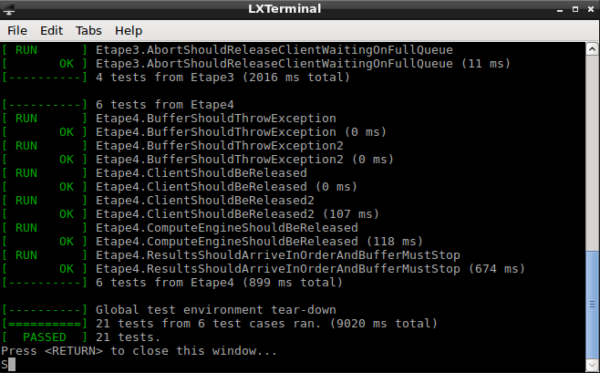

# HEIG - PCO Laboratoire 6 - Producteur et Consommateur
Auteurs : Arthur Bécaud et Bruno Egremy
## Étape 1 - _requestComputation_ et _getWork_
### Objectif
Cette étape consiste à gérer les producteurs et consommateurs de _Request_.
### Strucure de données des _requests_
Pour commencer, il nous a fallu définir notre structure de données qui servira à stocker les _requests_ parmi les trois types de _computation_ en offrant la fonctionnalité d'une FIFO avec la possibilité de supprimer n'importe quel élément de la structure en tout temps (prévision pour les _aborts_).

Nous avons décidé d'utiliser un _vector_ contenant des _deque_ de _requests_ ( _std::vector<std::deque<Request>>_ ) pour chaque type de _computation_. Ainsi nous aurons une _FIFO_ pour chaque type. La _deque_ à l'index 0 de _vector_ sera pour les _computations_ de type _A_, l'index 1 pour les _B_ et ainsi de suite.
### Section critique et _monitoring_
Étant donné que notre structure de données sera utilisée par plusieurs _threads_, il est nécessaire de la protéger dans un _monitorIn()_ et _monitorOut()_.

De plus, il existe deux conditions sur l'utilisation de la structure de données des _requests_ :

Premièrement le nombre de _requests_ par type est limité à 10 par défaut. Afin de gérer cette situation. Il faut pouvoir faire attendre le client s'il ajoute un calcul dans une _FIFO_ pleine. Nous avons utilisé un _vector_ de _PcoHoareMonitor::Condition_ qui permettra de gérer le nombre de _requests_ pour chacune des _FIFO_. Comme pour les _deques_, l'index 0 est pour les _A_, etc.

En deuxième il faut pouvoir mettre un calculateur en attente s'il demande du travail alors qu'aucune _request_ d'un certain type n'est disponible. Nous avons donc utilisé un 2ème _vector_ de _PcoHoareMonitor::Condition_ pour distinguer les types de _computations_ comme pour la première condition.
### Implémentation
**Attributs et déclarations :**
```c++
std::vector<std::deque<Request>> requests;
std::vector<Condition>           waitRequestType;
std::vector<Condition>           waitQueuesFreeSpace;
size_t                           idCnt;
```
Nous retrouvons ici la structure de données des _requests_, les deux _vectors_ de conditions et un compteur d'id pour assigner des identifiants uniques à chaque _computation_.
```c++
/**
 * @brief The ComputationType enum represents the abstract computation types that are available
 */
enum class ComputationType {A, B, C, NB_TYPE};
```
Nous avons ajouté un élément _NB_TYPE_ en fin de l'_enum_ pour indiquer le nombre de types. Ceci nous permet d'éviter des nombres magiques dans le code.

**Constructeur :**

```c++
ComputationManager::ComputationManager(int maxQueueSize):
    MAX_TOLERATED_QUEUE_SIZE(maxQueueSize),
    requests((size_t) ComputationType::NB_TYPE),
    waitRequestType((size_t) ComputationType::NB_TYPE),
    waitQueuesFreeSpace((size_t) ComputationType::NB_TYPE),
    idCnt(0) { }
```

Le constructeur initialise la constante du nombre maximum de _requests_ dans chaque _FIFO_ et les trois _vectors_ avec le nombre de type dans l'_enum_ _ComputationType_.

**requestComputation :**
```c++
int ComputationManager::requestComputation(Computation c) {

    monitorIn();

    // Verify if the appropriate queue as less than MAX_TOLERATED_QUEUE_SIZE requests.
    if (requests.at((int) c.computationType).size() == MAX_TOLERATED_QUEUE_SIZE) {
        wait(waitQueuesFreeSpace.at((size_t) c.computationType));
    }

    // Add a request to the appropriate queue.
    requests.at((int) c.computationType).push_back(Request(c, (int) idCnt));

    // Make a signal for the new request
    signal(waitRequestType.at((size_t) c.computationType));

    monitorOut();

    return (int) idCnt++;
}

```
La fonction monitorée commence par vérifier une fois si la _FIFO_ du bon type de _computation_ est pleine. Si c'est le cas, l'appel devient bloquant  jusqu'à ce que la _FIFO_ soit libérée d'une _request_ via un appel à _getWork_ par un calculateur du type correspondant.

Après la vérification ou l'attente, nous créons une nouvelle _request_ à partir du _computation_ fournit et l'ajoutons dans la bonne _FIFO_.

Il faut ensuite signaler qu'une nouvelle _request_ est disponible pour possiblement débloquer un calculateur en attente de travail.

La fonction termine par retourner l'id de la _request_ puis incrémente le compteur d'id.

**getWork :**
```c++
Request ComputationManager::getWork(ComputationType computationType) {

    monitorIn();

    // Verify if there is a request in the appropriote queue.
    if (requests.at((size_t) computationType).empty()) {
        wait(waitRequestType.at((size_t) computationType));
    }

    // Retrieve and remove the request from the appropriate queue.
    Request request = requests.at((size_t) computationType).front();
    requests.at((size_t) computationType).pop_front();

    // Signal that a request was retrieved
    signal(waitQueuesFreeSpace.at((size_t) computationType));

    monitorOut();

    return request;
}
```
La fonction monitorée vérifie premièrement si une _request_ est disponible dans le type de _computation_ demandé. Si aucune n'est disponible, l'appel devient bloquant jusqu'à l'arrivée d'une _request_ du bon type.

Après la vérification ou l'attente, il faut récupérer et supprimer la _request_ de sa _FIFO_.

Puis signaler que la _FIFO_ de la _request_ possède à présent une place pour une nouvelle _request_ avant de retourner la _request_ récupérée.

## Étape 2 - _getNextResult_ et _provideResult_
### Objectif
Cette étape consiste à gérer les producteurs et consommateurs de _Result_.
### Strucure de données des _results_
Afin de stocker les _results_ des calculateurs, il nous faut choisir une structure de données qui nous permettra de garder  l'ordre d'arrivée des _computations_ avec la possibilité de supprimer une _computation_ en tout temps sans impacter l'intégrité de la structure (prévision pour les _aborts_).

Pour remplir ces conditions, nous avons choisi d'utiliser une _list_ de _results_ ( _std::list<Result>_ ) et une _map_ de paire id, itérateur de _list_ ( _std::map<size_t, std::list<Result>::iterator>_ ).

La _list_ permet de stocker les _results_ au fils de leur arrivée.

La _map_ sert à lister tous les _results_ attendus, grâce à des itérateurs de _list_, dans l'ordre pour le client.
### Section critique et _monitoring_
Étant donné que notre structure de données sera utilisée par plusieurs _threads_, il est nécessaire de la protéger dans un _monitorIn()_ et _monitorOut()_.

De plus il faut ajouter une condition au client pour vérifier si un _result_ existe lorsqu'il essaye d'en récupérer un.
### Implémentation
**Attributs et déclarations :**
```c++
typedef size_t                      id;
typedef std::list<Result>::iterator listIndex;

std::list<Result>                   results;
std::map<id, listIndex>             resultsIndex;
Condition                           waitResult;
```
Nous retrouvons ici la structure de données des _results_, avec une utilisation de _typedef_ pour simplifier la pair de la _map_, et la condition lors des appels du client.

**requestComputation :**
```c++
int ComputationManager::requestComputation(Computation c) {

    monitorIn();

    // Verify if the appropriate queue as less than MAX_TOLERATED_QUEUE_SIZE requests.
    if (requests.at((int) c.computationType).size() == MAX_TOLERATED_QUEUE_SIZE) {
        wait(waitQueuesFreeSpace.at((size_t) c.computationType));
    }

    // Add a request to the appropriate queue.
    requests.at((int) c.computationType).push_back(Request(c, (int) idCnt));

    // Add a placeholder result.                                         // NEW!
    resultsIndex.insert(std::pair<id, listIndex>(idCnt, results.end())); // NEW!

    // Make a signal for the new request
    signal(waitRequestType.at((size_t) c.computationType));

    monitorOut();

    return (int) idCnt++;
}
```
Nous avons modifié cette fonction en ajoutant la réservation d'un espace dans la _map_ avec l'id du _computation_ et un itérateur sur la fin de la _list_ des _results_. La _map_ utilisera les identifiants pour trier les pairs, ce qui permet d'obtenir l'ordre des _results_ pour le client.

**getNextResult :**
```c++
Result ComputationManager::getNextResult() {

    monitorIn();

    // Verify if the next result is available.
    while (resultsIndex.empty() || resultsIndex.begin()->second == results.end()) {
        wait(waitResult);
    }

    // Retrieve the result from the list.
    Result result = * (resultsIndex.begin()->second);

    // Remove the result from the list and the result entry from the map.
    results.erase(resultsIndex.begin()->second);
    resultsIndex.erase(resultsIndex.begin());

    monitorOut();

    return result;
}
```
La fonction monitorée débute en vérifiant en boucle si la _map_ est vide ou si l'itérateur du premier élément de la _map_ itère sur la fin de la _list_. Si c'est le cas, l'appel devient bloquant jusqu'à ce qu'un nouveau _result_ soit fournit. Il est possible que le nouveau _result_ ne soit pas celui attendu, c'est  pour ça qu'il faut effectuer la vérification en boucle jusqu'à l'arrivée du bon _result_.

Après la vérification, nous récupérons le _result_ grâce à l'itérateur dans la paire. Puis nous supprimons le _result_ de la _list_ et la pair de  la _map_ avant de retourner le _result_ à l'appelant.

**provideResult :**
```c++
void ComputationManager::provideResult(Result result) {

    monitorIn();

    // Add the result to the vector.
    results.push_back(result);

    // Add the iterator to the result in the list 'results'.
    resultsIndex[result.getId()] = --(results.end());

    // Signal that a new result is available.
    signal(waitResult);

    monitorOut();
}
```
La fonction monitorée ajoute le nouveau _result_ dans la _list_. Puis donne l'itérateur du nouveau _result_ à la pair avec l'id correspondant dans la _map_. Après nous signalons qu'un nouveau _result_ est disponible pour possiblement  débloquer le _thread_ du client lors d'un appel à _getNextResult_.
## Étape 3 - _abortComputation_ et _continueWork_
### Objectif
Cette étape ajoute la fonctionnalité d'annulation des _computation_ que le client a demandé.
### Section critique et _monitoring_
Les deux fonctions vont devoir manipuler les structures de données. Il est ainsi nécessaire d'utiliser _monitorIn()_ et _monitorOut()_ dans chacune des fonctions.
### Implémentation
**abortComputation :**
```c++
void ComputationManager::abortComputation(int id) {
    monitorIn();

    auto iterator = resultsIndex.find(id);

    // Verify if the id exist.
    if (iterator == resultsIndex.end()) {
        monitorOut();
        return;
    }

    // Verify if a result already exist.
    if (iterator->second != results.end()) {
        results.erase(iterator->second);
    } else {
        // If not,
        // try to find the request using the given id.
        // If the request is found, removes it
        // from the requests deque and from the 'resultsIndex' map.
        for (size_t i = 0; i < (size_t) ComputationType::NB_TYPE; i++) {
            for (size_t j = 0; j < requests.at(i).size(); j++) {
                if (requests.at(i).at(j).getId() == id) {
                    requests.at(i).erase(requests.at(i).begin() + j);

                    // Signal that a request was deleted.
                    // There is now room for a new one.
                    signal(waitQueuesFreeSpace.at(i));

                    monitorOut();
                    return;
                }
            }
        }
    }

    // Remove the resultIndex in all cases.
    resultsIndex.erase(id);

    monitorOut();
}
```
La fonction monitorée commence par chercher l'id donné dans la _map_ pour  stocker l'itérateur de la pair dans une variable locale. Ceci pour éviter de chercher cet itérateur à plusieurs reprise dans la _map_.

Ensuite nous vérifions si nous avons trouvé l'id dans la _map_ grâce à la valeur de l'itérateur pour prendre en compte le cas où le client nous donnerait un id inexistant. Si l'id n'existe pas, nous fermons le moniteur et quittons la fonction.

Après ça, nous devons voir si un résultat existe déjà dans la _list_. Pour ça il nous suffit de regarder où itère l'itérateur dans la pair. S'il n'itère pas à la fin de la liste cela veut dire qui faut supprimer un _result_ de la _list_. Dans le cas contraire où il itère à la fin de la liste, cela indique que la _request_ n'a pas encore été consommée. Il faut ainsi la chercher dans la liste, la supprimer et ensuite signaler qu'un nouvel emplacement est disponible dans la _FIFO_ correspondante.

Pour finir, il faut dans tous les cas supprimer la paire de la _map_.

**continueWork :**
```c++
bool ComputationManager::continueWork(int id) {
    monitorIn();

    // Try to found resultIndex is found with the given id.
    bool canContinueToWork = resultsIndex.find(id) != resultsIndex.end();

    monitorOut();

    return canContinueToWork;
}
```
La fonction monitorée va simplement vérifier si l'id donné existe dans la _map_ puis retourner ce résultat. S'il n'existe pas, cela indique que l'id est invalide ou que la _computation_ a été avortée.

**provideResult :**
```c++
void ComputationManager::provideResult(Result result) {

    monitorIn();

    // If the computation was aborted, there is no need to provide any result. //NEW!
    if (resultsIndex.find(result.getId()) == resultsIndex.end()) {             //NEW!
        monitorOut();                                                          //NEW!
        return;                                                                //NEW!
    }                                                                          //NEW!

    // Add the result to the vector.
    results.push_back(result);

    // Add the iterator to the result in the list 'results'.
    resultsIndex[result.getId()] = --(results.end());

    // Signal that a new result is available.
    signal(waitResult);

    monitorOut();
}
```
Nous avons modifié cette fonction en ajoutant une vérification de l'existance du _result_ en paramètre dans la _map_. Si il existe, Nous fermons le moniteur et quittons la fonction. Nous devons ajouter cette fonctionnalité, car il est possible qu'un calculateur essaye de donner un _result_ avorté.

## Étape 4 - _stop_
### Objectif
Mettre en place la gestion de la terminaison du buffer.
### Implémentation
**Attributs et déclarations :**
```c++
std::vector<size_t> nbComputerWaiting;
```
Nous avons dû ajouter des compteurs pour les calculateurs en attente de travail lors des appels  à la fonction _getWork_. Sans ça, nous ne pouvons pas signaler tous les calculateurs en attente lors d'un appel à _stop_.

**stop :**
```c++
void ComputationManager::stop() {
    monitorIn();
    stopped = true;

    for (size_t i = 0; i < (size_t) ComputationType::NB_TYPE; i++) {
        auto nbToSignal = nbComputerWaiting.at(i);
        for (size_t j = 0; j < nbToSignal; j++) {
            signal(waitRequestType.at(i));
        }
        signal(waitQueuesFreeSpace.at(i));
    }
    signal(waitResult);

    monitorOut();
}
```
La fonction monitorée va simplement changer la valeur de la variable _stopped_ à _true_ puis signaler tous les threads possiblement en attente. Voici la liste des appels bloquant à signaler :
- Il faut signaler tous les calculateurs en attente dans _getWork_. Nous utilisons le _vector_ _nbComputerWaiting_ pour compter les threads en attentes à cette endroit.
- Le client peut possiblement être en attente d'un emplacement libre dans l'une  des _FIFO_ après un appel à _requestComputation_. Nous devons signaler qu'un nouvel emplacement est libre dans chaque _FIFO_.
- Le client peut aussi être en attente d'un résultat dans _getNextResult_.

**leaveMonitorIfStopped :**
```c++
void ComputationManager::leaveMonitorIfStopped() {
    // Use 'throwStopException' if the 'stop()' function was called.
    if (stopped == true) {
        monitorOut();
        throwStopException();
    }
}
```
Nous avons ajouté cette fonction _leaveMonitorIfStopped_ qui permet de quitter une fonction monitorée via un appel à _throwStopException_ après un appel à _stop_. Nous utilisons cette fonction avant et après chaque appel à _PcoHoareMonitor::wait(...)_

**getWork :**
```c++
Request ComputationManager::getWork(ComputationType computationType) {

    monitorIn();

    // Verify if there is a request in the appropriote queue.
    if (requests.at((size_t) computationType).empty()) {

        leaveMonitorIfStopped();                          // NEW!

        ++nbComputerWaiting.at((size_t) computationType); // NEW!
        wait(waitRequestType.at((size_t) computationType));
        --nbComputerWaiting.at((size_t) computationType); // NEW!

        leaveMonitorIfStopped();                          // NEW!
    }

    // Retrieve and remove the request from the appropriate queue.
    Request request = requests.at((size_t) computationType).front();
    requests.at((size_t) computationType).pop_front();

    // Signal that a request was retrieved and removed from the appriopriate queue.
    signal(waitQueuesFreeSpace.at((size_t) computationType));

    monitorOut();

    return request;
}
```
Nous avons ajouté les appel à _leaveMonitorIfStopped()_ et l'incrémentation/décrémentation des compteurs avant et après l'appel à _wait_. Ceci pour permettre au nombre de threads appelant d'être interrompu proprement.

**requestComputation :**
```c++
int ComputationManager::requestComputation(Computation c) {

    monitorIn();

    // Verify if the appropriate queue as less than MAX_TOLERATED_QUEUE_SIZE requests.
    if (requests.at((int) c.computationType).size() == MAX_TOLERATED_QUEUE_SIZE) {

        leaveMonitorIfStopped();  // NEW!

        wait(waitQueuesFreeSpace.at((size_t) c.computationType));

        leaveMonitorIfStopped();  // NEW!
    }

    // Add a request to the appropriate queue.
    requests.at((int) c.computationType).push_back(Request(c, (int) idCnt));

    // Add a placeholder result.
    resultsIndex.insert(std::pair<id, listIndex>(idCnt, results.end()));

    // Make a signal for the new request
    signal(waitRequestType.at((size_t) c.computationType));

    monitorOut();

    return (int) idCnt++;
}
```
Nous avons ajouté un appel à _leaveMonitorIfStopped()_ avant et après l'appel à _wait_ pour permettre au thread appelant d'être interrompu proprement.

**getNextResult :**
```c++
Result ComputationManager::getNextResult() {

    monitorIn();

    // Verify if the next result is available.
    while (resultsIndex.empty() || resultsIndex.begin()->second == results.end()) {

        leaveMonitorIfStopped();

        wait(waitResult);

        leaveMonitorIfStopped();
    }

    // Retrieve the result from the list.
    Result result = * (resultsIndex.begin()->second);

    // Remove the result from the list and the result entry from the map.
    results.erase(resultsIndex.begin()->second);
    resultsIndex.erase(resultsIndex.begin());

    monitorOut();

    return result;
}
```
Nous avons ajouté un appel à _leaveMonitorIfStopped()_ avant et après l'appel à _wait_ pour permettre au thread appelant d'être interrompu proprement.

**continueWork :**
```c++
bool ComputationManager::continueWork(int id) {
    monitorIn();

    // Verify if the 'stop()' function was called. // NEW!
    if (stopped == true) {                         // NEW!
        monitorOut();                              // NEW!
        return false;                              // NEW!
    }                                              // NEW!

    // Try to found resultIndex is found with the given id.
    bool canContinueToWork = resultsIndex.find(id) != resultsIndex.end();

    monitorOut();

    return canContinueToWork;
}
```
La fonction _continueWork_ retourne à présent _false_ dans tous les cas après un appel à _stop_.

## Tests
Afin de vérifier si notre implémentation était fonctionnelle. Nous avons principalement utilisé la configuration _labo6_tests_ fournit dans le projet _QT Creator_. Ceci nous a permis de tester l'application à chaque étape.

Nous voyons avec la capture suivante que notre implémentation semble correcte.



À côté de ça, nous avons aussi testé notre implémentation via l'interface graphique.
